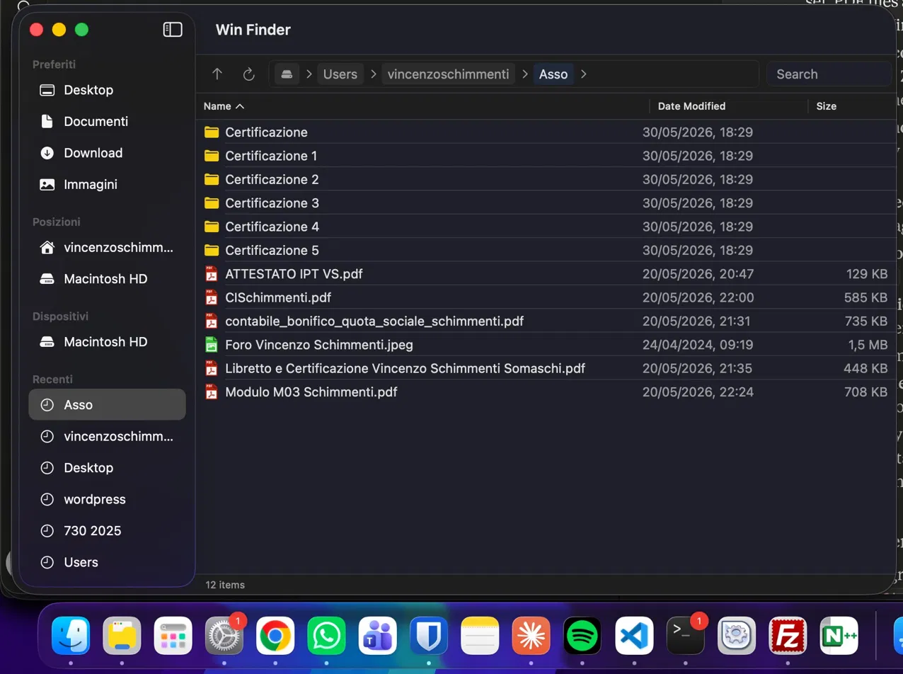

# Win Finder

Ein Dateimanager für macOS, der sich wie zu Hause anfühlt — für alle, die von Windows kommen.

🇬🇧 [English](README.md) &nbsp; 🇮🇹 [Italiano](README.it.md) &nbsp; 🇩🇪 Deutsch &nbsp; 🇪🇸 [Español](README.es.md) &nbsp; 🇨🇳 [中文](README.zh.md) &nbsp; [🇲🇬 Malagasy ❤️](README.mg.md)



## Neu in Version 0.3.0

- **[Issue #2](https://github.com/Skimmenthal13/winfinder/issues/2) behoben** — die Abweichung zwischen den dokumentierten macOS-Anforderungen und der veröffentlichten App wurde korrigiert. Version 0.3.0 setzt macOS 14 Sonoma oder neuer auf Apple Silicon und Intel voraus; macOS 13 wird nicht unterstützt.
- **Flüssigere Dateiübertragungen** — Kopieren und Verschieben laufen im Hintergrund, mit Fortschritt pro Element und einer Fehlerübersicht. Unvollständige Kopien erscheinen nicht als fertige Dateien.
- **Zuverlässigere Dateiaktionen** — Ausschneiden und Einfügen funktionieren zwischen Fenstern; fehlgeschlagene Verschiebungen können erneut versucht werden. Tastaturbefehle gelten nur für das aktive Fenster. Fehler beim Erstellen, Umbenennen und Löschen werden angezeigt.
- **ZIP-Erstellung im Hintergrund** — erhält Unterordnerpfade und vorhandene Archive und hinterlässt bei Fehlern keine unvollständigen Archive.
- **Navigation und Tastaturkürzel** — Verlauf mit Vor/Zurück über `Option+Links/Rechts`, Umbenennen mit `F2`, Kürzel für neue Dateien und Ordner sowie eine Übersicht der Tastaturkürzel.
- **Suche und Sortierung** — aktive Suchen werden bei Dateiänderungen aktualisiert, veraltete Suchen abgebrochen und bei mehr als 500 Treffern erscheint ein Hinweis. Die Sortierung bleibt bei Aktualisierungen und Suchen erhalten, mit Ordnern zuerst; veraltete Auswahlen werden nach Navigation oder Löschen entfernt.
- **Erweiterungen und Qualitätsprüfungen** — verbesserte Verarbeitung von Dateipfaden in Erweiterungsbefehlen, 17 Regressionstests und automatische Kompatibilitätsprüfungen für universelle Builds.

[0.3.0 herunterladen und Versionshinweise lesen](https://github.com/Skimmenthal13/winfinder/releases/tag/v0.3.0). App und DMG sind mit Developer ID signiert und von Apple notarisiert. Mindestversion und beide Architekturen wurden geprüft; direkte Laufzeittests unter macOS 14/15 und die Bestätigung des Issue-Melders stehen noch aus.

## Warum Win Finder?

macOS ist ein großartiges Betriebssystem. Aber wer jahrelang mit Windows gearbeitet hat, wird den Finder auf schwer erklärbare Weise falsch finden: keine bearbeitbare Pfadleiste, keine inline-Suche, kein "Neue Datei" per Rechtsklick, Entf löscht nicht. Kleine Dinge, die zusammen zu ständiger Reibung führen.

Win Finder löst das. Es ist ein nativer macOS-Dateimanager, der auf den Arbeitsabläufen aufbaut, die Windows-Nutzer bereits kennen.

## Funktionen

- **Bearbeitbare Pfadleiste** — immer sichtbar, 80% der Werkzeugleistenbreite. Klicken, Pfad eingeben, Enter drücken. Funktioniert genau wie der Windows Explorer.
- **Breadcrumb-Navigation** — die Pfadleiste zeigt jeden Ordner als klickbares Token. Auf ein Segment klicken, um dorthin zu navigieren. Auf `>` klicken, um Unterordner dieser Ebene zu sehen. Auf den leeren Bereich rechts klicken, um in den Textbearbeitungsmodus zu wechseln.
- **Inline-Suche** — Suchfeld immer neben der Pfadleiste sichtbar. Sucht standardmäßig rekursiv durch alle Unterordner. Unterstützt Wildcards (`*.pdf`, `doc*`). Ergebnisse zeigen den relativen Pfad.
- **Seitenleiste** — Favoriten (Desktop, Dokumente, Downloads, Bilder), Orte, Geräte und zuletzt verwendete Pfade — sitzungsübergreifend gespeichert.
- **Windows Explorer-ähnliche Liste** — Spalten Name, Änderungsdatum, Größe mit klickbaren Überschriften zum Sortieren. Ordner immer oben.
- **Bunte Dateisymbole** — 404 Dateityp-Icons aus dem Vivid-Set von [file-icon-vectors](https://github.com/dmhendricks/file-icon-vectors). PDFs sind rot, ZIPs lila, Swift-Dateien orange.
- **Kontextmenü (Rechtsklick)** — Öffnen, Öffnen mit, Kopieren, Ausschneiden, Einfügen, Umbenennen, Als ZIP komprimieren, Neuer Ordner, Neue Datei, AirDrop, Löschen.
- **Tastaturkürzel** — `Entf` verschiebt in den Papierkorb, `Shift+Entf` löscht dauerhaft mit Bestätigung, `Cmd+C` / `Cmd+V` kopiert und fügt Dateien ein.
- **Type-to-select** — Buchstabe drücken, um zur ersten Datei zu springen, die mit diesem Buchstaben beginnt. Erneut drücken, um durch Übereinstimmungen zu blättern.
- **Drag and Drop** — zwischen zwei Win Finder-Fenstern und zur/von der Seitenleiste. `Cmd` gedrückt halten beim Ziehen zum Kopieren statt Verschieben.
- **Mehrfachauswahl** — `Shift+Klick` für Bereichsauswahl, `Cmd+Klick` zum Umschalten einzelner Elemente.
- **AirDrop** per Rechtsklick — Dateien direkt teilen ohne den Finder zu öffnen.
- **Echtzeit-Dateisystemüberwachung** — die Liste aktualisiert sich automatisch, wenn sich Dateien auf dem Datenträger ändern.
- **Erweiterungssystem** — benutzerdefinierte Aktionen zum Kontextmenü über JSON-Dateien hinzufügen. Unterstützt verschachtelte Untermenüs, Trennlinien, benutzerdefinierte Icons und Kontextfilterung. Alles verwalten über **Win Finder → Erweiterungen verwalten**.
- **Mehrsprachig** — verfügbar auf Englisch 🇬🇧, Italienisch 🇮🇹, Deutsch 🇩🇪, Spanisch 🇪🇸, Vereinfachtem Chinesisch 🇨🇳 und Malagasy 🇲🇬 ❤️. Die Sprache der Benutzeroberfläche folgt automatisch der Systemsprache.

## Erweiterungssystem

Jede App kann sich mit Win Finder integrieren, indem ein Ordner in `~/.config/winfinder/actions/` mit einer `action.json` und einem optionalen `icon.png` erstellt wird.

**Felder:**
- `name` — Bezeichnung im Menü
- `extensions` — Dateiendungen zum Abgleichen, oder `["*"]` für alle Dateien
- `context` — wo die Aktion erscheint: `"file"`, `"folder"`, `"background"`
- `command` — auszuführender Shell-Befehl, `{file}` wird durch den Dateipfad ersetzt
- `submenu` — Array verschachtelter Elemente
- `icon` — optionaler Pfad zu einer PNG-Datei
- `separator` — auf `true` setzen für eine Trennlinie

## Installation

### Voraussetzungen
- macOS 14 Sonoma oder neuer
- Apple Silicon oder Intel Mac

> Version 0.3.0 benötigt macOS 14+. Die älteren DMGs v0.2.0 und v0.1.8 bleiben unverändert und benötigen macOS 26.

### Aus dem Quellcode erstellen

```bash
git clone https://github.com/Skimmenthal13/winfinder.git
cd winfinder
open winfinder.xcodeproj
```

Dann `Cmd+R` in Xcode drücken, um zu erstellen und auszuführen.

## Mitwirken

Win Finder ist Open Source und freut sich über Beiträge. Wenn du von Windows gewechselt bist und etwas nicht stimmt, öffne ein Issue.

1. Repository forken
2. Branch erstellen (`git checkout -b feature/dein-feature`)
3. Änderungen committen
4. Pull Request öffnen

## Danksagungen

Dateityp-Icons von [file-icon-vectors](https://github.com/dmhendricks/file-icon-vectors) von [@dmhendricks](https://github.com/dmhendricks) — eine fantastische Sammlung von 400+ SVG-Icons, Lizenz CC BY-SA 4.0. Danke, dass du sie der Community zur Verfügung stellst.

## Lizenz

MIT — mach damit, was du willst.

---

Erstellt von [@Skimmenthal13](https://github.com/Skimmenthal13) — ein Windows-Flüchtling, der genug vom Finder hatte.

## Rechtliches
- [Datenschutzerklärung](https://skimmenthal13.github.io/winfinder/privacy-policy.html)
- [Nutzungsbedingungen](https://skimmenthal13.github.io/winfinder/terms-of-service.html)
