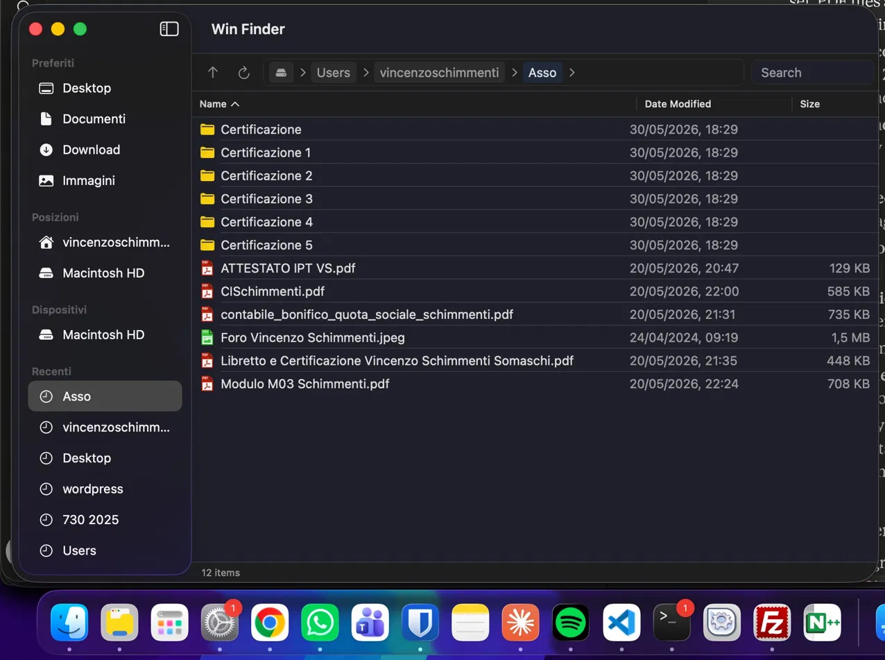

# Win Finder

Mpitantana rakitra ho an'ny macOS izay mahatsapa toy ny any an-trano — ho an'izay avy amin'ny Windows.

🇬🇧 [English](README.md) &nbsp; 🇮🇹 [Italiano](README.it.md) &nbsp; 🇩🇪 [Deutsch](README.de.md) &nbsp; 🇪🇸 [Español](README.es.md) &nbsp; 🇨🇳 [中文](README.zh.md) &nbsp; 🇲🇬 Malagasy



## Nahoana Win Finder?

Tsara ny macOS. Fa raha efa nandany taona tamin'ny Windows ianao, ny Finder dia hiseho ho diso amin'ny fomba sarotra azo lazaina: tsy misy bary lalan-kalam-panovana, tsy misy fikarohana inline, tsy misy "Rakitra vaovao" amin'ny kilik-kavanana, ny fafana tsy mamafa. Zavatra kely izay mitambatra mamorona fanozongozona mifandimby.

Win Finder mamaha izany. Izy io dia mpitantana rakitra macOS teratany naorina manodidina ny fomba fiasa efa fantatry ny mpampiasa Windows.

## Endri-javatra

- **Bary lalan-kalam-panovana** — hita foana, 80% ny sakany. Kilikeo, soraty ny lalana, tsindrio Enter. Miasa toy ny Windows Explorer.
- **Fikarakarana breadcrumb** — ny bary lalana maneho ny folder tsirairay ho token azo kilikiana. Kilikeo ny fizarana rehetra hikaohina any. Kilikeo ny `>` hahitana ny subfolder amin'io ambaratonga io. Kilikeo ny banga eo ankavanan'ny laharana hifindra amin'ny fomba lahatsoratra azo novaina.
- **Fikarohana inline** — saha fikarohana hita foana eo anilan'ny bary lalana. Mikaroka an-drenirano amin'ny subfolder rehetra amin'ny alalan'ny default. Manohana wildcards (`*.pdf`, `doc*`). Ny vokatra maneho ny lalana mifandray.
- **Bary andaniny** — Tiako (Desktop, Antontan-taratasy, Alefa, Sary), Toerana, Fitaovana ary lalana Vao haingana — voatahiry amin'ny fitokanana rehetra.
- **Lisitra toy ny Windows Explorer** — tsanganana Anarana, Daty nanovana, Haben'ny tsanganana azo kilikiana mba handrindrana. Ny folder foana eo ambony.
- **Sary rakitra marevaka** — ikona karazana rakitra 404 avy amin'ny [file-icon-vectors](https://github.com/dmhendricks/file-icon-vectors) Vivid set. Mena ny PDF, volomparasy ny ZIP, volamena ny rakitra Swift.
- **Menio fifehezana kilik-kavanana** — Misokatra, Misokatra amin'ny, Adika, Tapaka, Vatsio, Ataovy anarana vaovao,压缩成ZIP, Folder vaovao, Rakitra vaovao, AirDrop, Fafao.
- **Fanalahidy amin'ny keyboard** — `Fafana` mampifindra any amin'ny Basket, `Shift+Fafana` mamafa tsy miverina amin'ny fanamafisana, `Cmd+C` / `Cmd+V` adika sy vatsio rakitra.
- **Safidy amin'ny kaody** — tsindrio litera iray mba hihorana any amin'ny rakitra voalohany manomboka amin'io litera io. Tsindrio indray mba hivezivezy amin'ny vokatra.
- **Seren-tana sy alefa** — eo anelanelan'ny varavarankely Win Finder roa, ary avy amin'ny bary andaniny. Ny `Cmd` notanana mandritra ny fitaomana adika fa tsy mifindra.
- **Safidy maro** — `Shift+kilik` ho an'ny safidy ambaratonga, `Cmd+kilik` hanova zavatra tsirairay.
- **AirDrop** avy amin'ny kilik-kavanana — zarao mivantana ny rakitra rehetra tsy misokatra ny Finder.
- **Fanaraha-maso ny rafitra rakitra amin'ny fotoana tena izy** — ny lisitra mavaivay ho azy rehefa miovaova ny rakitra amin'ny disque.
- **Rafitra fanitarana** — ampio ny hetsika custom amin'ny menio fifehezana amin'ny alalan'ny rakitra JSON. Manohana submenio mifanakatona, misaraka, ikona custom, ary fanamafisana ara-tontolon'andro. Tantano ny zavatra rehetra avy amin'ny **Win Finder → Tantano ny fanitarana**.
- **Amin'ny fiteny maro** — misy amin'ny anglisy 🇬🇧, italiana 🇮🇹, alemà 🇩🇪, espaniola 🇪🇸, sinoa tsotra 🇨🇳 ary malagasy 🇲🇬. Ny fiteny an'ny interface manaraka ny fiteny an'ny rafitra ho azy.

## Rafitra fanitarana

Ny app rehetra dia afaka mifandray amin'ny Win Finder amin'ny alalan'ny famoronana folder ao amin'ny `~/.config/winfinder/actions/` miaraka amin'ny rakitra `action.json` sy `icon.png` tsy voatery:

**Saha:**
- `name` — label aseho amin'ny menio
- `extensions` — fanitaran'ny rakitra mifandrindra, na `["*"]` ho an'ny rakitra rehetra
- `context` — izay isehoana ny hetsika: `"file"`, `"folder"`, `"background"`
- `command` — baiko shell hoezahina, `{file}` soloina amin'ny lalana rakitra voafidy
- `submenu` — array zavatra mifanakatona
- `icon` — lalana tsy voatery ho an'ny rakitra PNG
- `separator` — apetraho amin'ny `true` ho an'ny mizara menio

## Fametrahana

### Fepetra takiana
- macOS 13 Ventura na any ambony kokoa
- Mac Apple Silicon na Intel

### Amboary avy amin'ny loharano

```bash
git clone https://github.com/Skimmenthal13/winfinder.git
cd winfinder
open winfinder.xcodeproj
```

Avy eo tsindrio `Cmd+R` ao amin'ny Xcode mba hanamboarana sy hampiasana.

## Fandraisan'anjara

Win Finder dia open source ary mankasitraka ny fandraisan'anjara. Raha nifindra avy amin'ny Windows ianao ary misy tsy mety, misokatra issue.

1. Fork ny repo
2. Mamorona sampana (`git checkout -b feature/ny-endri-javatra-anao`)
3. Commit ny fanovana anao
4. Misokatra pull request

## Fisaorana

Ikona karazana rakitra avy amin'ny [file-icon-vectors](https://github.com/dmhendricks/file-icon-vectors) nataon'i [@dmhendricks](https://github.com/dmhendricks) — fitangoranan'ny ikona SVG 400+ mahafinaritra, lisansa CC BY-SA 4.0. Misaotra fa nataon'ny vondron'olona.

## Lisansa

MIT — ataovy izay tianao.

---

Naorin'i [@Skimmenthal13](https://github.com/Skimmenthal13) — mpitsoa-ponenana avy amin'ny Windows izay tsy nanana antoka intsony tamin'ny Finder.

> 🤖 Ity tetikasa manontolo ity dia naorina tamin'ny **vibe coding** mampiasa [Claude Code](https://claude.ai/code) — hatramin'ny andalana Swift voalohany ka hatramin'ny rafitra fanitarana, ny fikarakarana breadcrumb ary ny ikona rakitra. Tsy menatra, faly fotsiny.
